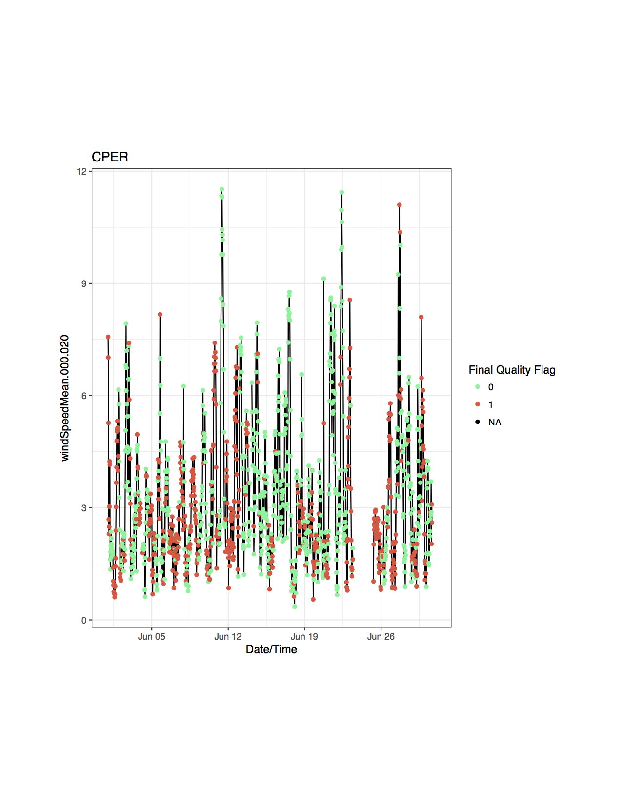

\newpage
```{r setup, include=FALSE}
library(Noble)
library(xtable)
library(knitr)
```

## Introduction
This is a quick introduction and user guide to the *Noble* package, version `r packageVersion("Noble")`. It discusses the functions and data contained in *Noble*, but is not intended as an exhaustive reference for the package. For more information check the help files of the individual functions, or contact Robert Lee at rlee@battelleecology.org.

\newpage

## Installation
Currently, *Noble* is a strictly in-house tool developed for instrumented systems commissioning. Additionally, access to the the Commissioning-TIS repo is very limited, so the best way to install the package is from the source package, in the form of a .ZIP. Once you have the source .ZIP file, run the following code:
  
>`install.packages(file.choose(), repos=NULL, type="source")`

This command will open a GUI file browser. Simply navigate to the directory where the saved .ZIP version of the package lives, and open it.

The package has some dependencies which may not be installed. If you haven't installed the underlying packages, *Noble's* install will fail with an error about which package is missing. Use the `install.packages()` commmand to install the missing package, and try again. For conveinence, the code to install all underlying packages is:  
 `install.packages("lubridate")    # Package to work with POSIX dates and times`  
 `install.packages("zoo")          # Package to work with 'irregurlar' dates and times`  
 `install.packages("nneo")         # ROpenSci's API client for NEON`  
 `install.packages("ggplot2")      # Robust plotting package`   
 `install.packages("data.table")   # Data manipulation for plotting`  
 `install.packages("jsonlite")     # Package to parse JSON objects`  
 
Once the package is successfully installed in can be loaded to the global environment via the standard `library(Noble)` command.
\newpage

## Downloading Data
Changes in NEON's data products and the NEON API have rendered other packages unable to download data- *Noble* was created to address these issues and allow for reliable downloading. The only function in *Noble* is to return data is `pull.data()`, which retrieves data in 1 month chunks for all locations (tower levels and/or soil plots) at a given site. Data are stored to the user specified directory, and are also returned to the Global Environment. This allows for either storing data locally, or simply loading data temporarily. To save data, specify a valid local directory in the  **save.dir** parameter:

```{r save_to_file, message=FALSE, warning=FALSE, include=TRUE, eval=FALSE}
Noble::data.pull(site = "CPER", dpID = "DP1.00001.001", bgn.month = "2017-06", 
    end.month = "2017-06", time.agr = 30, package = "basic", save.dir = "/Users/rlee/")
```

Note that data are also returned to the environment, but are only printed to the console (not stored), because an output was not specified. We can save both the data returned to R and a file to the specified directory with the following code:  
```{r save_to_both, message=FALSE, warning=FALSE, include=TRUE, eval=FALSE}
CPER_2D=Noble::data.pull(site = "CPER", dpID = "DP1.00001.001", bgn.month = "2017-06", 
    end.month = "2017-06", time.agr = 30, package = "basic", save.dir = "/Users/rlee/")
```
Note that the data are availble in the R session via the 'CPER_2D' object, and data have been saved to '/Users/rlee/'.  

If you want data returned to the R environment only with no file saved to your local disk, use the handy `tempdir()` command to put the returned data file into a temporary directory. This directory will be deleted when the R session ends. `tempdir()` can be directly assigned to the **save.dir** parameter:  
```{r save_to_object, message=FALSE, warning=FALSE, include=TRUE}
CPER_2D=Noble::data.pull(site = "CPER", dpID = "DP1.00001.001", bgn.month = "2017-06", 
    end.month = "2017-06", time.agr = 30, package = "basic", save.dir = tempdir())
```
---
      
*Noble* also contains two functions to make locating data easier. The first, `NEON.avail()`, produces a matrix of data product availability for all IS sites, by month. Specifying a DP code for **dpID** is the only input needed.  

```{r NEON_avail, message=FALSE, warning=FALSE, include=TRUE}
wind_avail=Noble::NEON.avail(dpID = "DP1.00001.001")
```

```{r avail_table, echo=FALSE, message=FALSE, warning=FALSE}

knitr::kable(wind_avail[,1:11])
```
  
In the returned table, an 'x' indicates that data should be available.  


The second function is `test.sites()`, which returns a list of sites with data for a given **dpID**, **bgn.month**, and **end.month**, where **bgn.month** and **end.month** refer to the first and last months of interest. This is meant to streamline data pulling for many sites at once. Sites are returned as their 4-letter site codes, without the domain:  
```{r test_sites, message=FALSE, warning=FALSE, include=TRUE}
wind_sites=Noble::test.sites (dpID = "DP1.00001.001", bgn.month = "2017-06", end.month = "2017-07")
head(wind_sites)
```

\newpage
## Working with Data
*Noble* also has two functions aimed at letting users perform analysis more quickly: `ml.extract()` and `find.gap()`.  

 `ml.extract()` does exactly what it sounds like, it will extract data for a given measurement level from a data frame generated by `pull.data()`:  
``` {r ml_extract,  message=FALSE, warning=FALSE, include=TRUE, eval=TRUE}
ML_2=Noble::ml.extract(data=CPER_2D, ml = 2)
```
  
Likewise, `find.gap()` returns a nested list of gap locations in a given dataset. Three lists are returned, `miss.times`, `no.data.times`, and `no.qf.times`. `miss.times` are gaps where CI-generated timestamps (and the associated records) are completely missing. `no.data.times` and `no.qf.times` report when data or final quality flags are missing, respecively. Either row numbers or times can be returned with the **return** parameter, though typically times are easier to understand. The below example shows the gaps found in the measurement level 2 data of CPER's 2D wind data from the examples above:  
  
``` {r find_gap,  message=FALSE, warning=FALSE, include=TRUE, eval=TRUE}
ML_2_Gaps=Noble::find.gap(data = ML_2, time.agr = 30, return = "times")

#Look at if any missing records were found:
head(ML_2_Gaps$miss.times)

#When was data missing?
head(ML_2_Gaps$no.data.times)

#When were quaility flags missing?
head(ML_2_Gaps$no.qf.times)

```
By comparing the data and quality flag timestamps, we can tease out whether the sensor was down, if the data was not processed correctly, or both.

Note that it is generally advisable to only investigate data gaps level by level, because a gap on just one ML will not show up when the whole site is being evaluated. Also note that the **time.agr** parameter is the temporal agregation value for the data being examined. If it isn't specified the function will attempt to guess the temporal agregation value. To avoid issues, this parameter should be used.

\newpage
## Commissioning Testing
The primary focus of *Noble* is to perform commissioning testing. The focus is on TIS testing, though many of the test functions will work for AIS as well. Currently, only process quality and system performance tests have been incorporated into the package, though data quaility test will be added later. 

### Process Quality Tests
Process quailty testing is a simple look at two properties of a data product:  
1. How much of the expected data is present (quantity testing)  
2. How much of the data are 'good' (validity testing)  

For the NEON commissioning effort, these two properties are examined by simply looking at how many records for the primary variable are present in the returned data, and how much of the data has had its final quality flag raised. The `tis_pq_test()` is the one-stop-shop for process quality testing, as it will retrieve data for the selected site and dates, save the data in an ordered directory structure, perform analysis of the data, and print results to a results file.

`tis_pq_test()` will only evaluate one data product or site at a time, so best practices for using this fucntion in a commissioning test is to call it once per data product, and use `lapply` to test multiple sites per data product, as shown below:  
```{r pq_test, eval=TRUE, warning=FALSE, message= FALSE}
# Specify general parameters for the test
dpID  = "DP1.00001.001" # 2D wind's DP code
bgn.month = "2017-05" # First month to test
end.month = "2017-06" # Last month to test
prin.vars=c("windDir", "windSpeed") # what variables to test

# List of sites
sites=c("CPER", "ONAQ", "BART")

sink=lapply(sites, function(x) try(Noble::tis.pq.test(site = x, dpID, prin.vars,
                                    bgn.month, end.month, save.dir=tempdir())))
rm(sink)
```

That function produces a results.csv in our temporary directory, which looks like this:
```{r results_out, echo=FALSE, message=FALSE, warning=FALSE}
results=read.csv(file=paste0(tempdir(), "/Common/results.csv"))
knitr::kable(results[1:6, 1:6])
knitr::kable(results[1:6, 7:length(colnames(results))])
```

Note that the thresholds for quantity and validity testing are also included in the output. These thresholds are generally 95% for quantity testing and 90% for validity testing, however they can vary from test to test. The values saved in the 'results.csv' file can be passed to `tis_pq_test()`, allowing for changes to the recorded thresholds on a test-by-test basis. Use **q.th** for the quantity threshold, and **v.th** for the validity threshold:   
```{r pq_test_TH, eval=TRUE, warning=FALSE, message= FALSE}
# Specify general parameters for the test
dpID  = "DP1.00001.001" # 2D wind's DP code
bgn.month = "2017-05" # First month to test
end.month = "2017-06" # Last month to test
prin.vars=c("windDir", "windSpeed") # what variables to test

Noble::tis.pq.test(site = "CPER", dpID, prin.vars,  bgn.month, 
             end.month, save.dir=tempdir(), q.th=88, v.th=83)
```

That function produces a results.csv in our temporary directory, which looks like this:
```{r results_out_TH, echo=FALSE, message=FALSE, warning=FALSE}
results=read.csv(file=paste0(tempdir(), "/Common/results.csv"))
knitr::kable(results[(length(results$site)-1):length(results$site), 1:6])
knitr::kable(results[(length(results$site)-1):length(results$site), 7:length(colnames(results))])
```

Note that if **q.th** and **v.th** aren't specified, the test will revert to using 95% and 90%, respectively.  

*Other tips:* When running `tis.pq.test()` in an `lapply()` function, I recommend wrapping `tis.pq.test()` with a `try()` function. `try()` will attempt to execute the function it wraps, and won't break out of the function if an error occurs. This means that if `tis.pq.test()` throws an error when testing a site, `try()` will let the `lapply()` move onto another site, rather than stopping the evaulation of the `lapply()`  

---

### System Performance Tests

System performance tests are more specialized than process quality test, and because they are of limited application accross commissioning tasks, I will only briefly describe the test fucntions associated with system performance. *Noble* has two functions for checking fan health of fans in aspirated air temperature assemblies (`fan.test()`) and the health of Grouped Remote Analog Peripheral Equipment (GRAPE) data loggers (.grape.test()).   

`fan.test()`, like `tis.pq.test()`, will cover the downloading, testing, and reporting of test results. Its implementation and output are much the same as `tis.pq.test()`, so parsing the results into a report manually or by using RMarkdown will be similar to the approach taken in process quality testing. 

`.grape.test()` is a unique fucntion, and will only work on the NEON internal network. Every time it is called, it removes files from the site and test specific directory in the Science Commissioning Archive (SCA), goes into Engineering's directory on the Common drive, copies sensor uptime logs from the Engineering directory to the site and test specific directory in the SCA, parses the files for GRAPES, tabulates uptimes, and reports the results in a 'results.csv' file. Because this test reads and overwrites files for each test site, it is a somewhat dangerous function, and is not available directly in the *Noble* package environment. Any users whishing to use this or any other functions dealing with GRAPEs need to contact Robert Lee before doing so.

\newpage

##Plotting and Data Exploration

To aid with troubleshooting and issue reporting for commissioning, *Noble* has a few functions to visualize sensor data: `pull.n.plot()` and `plot.wind.rose()`.  Many of the parameters for `pull.n.plot()` are the same as other functions in *Noble*, but there are two important parameters to note:  

1. **sites.req** can accept a list of sites to plot data for, not just one site at a time. However in certain situations using an `lapply()` and `try()` combination may be useful.  
2. **data.field** lets users specify the value in the returned data to be plotted. The full field name should be used for this parameter.  

The following code for `pull.n.plot()` will produces a PDF, saved to the specified **save.dir**, for 2D wind speed data for the month of June 2017:

```{r pull_n_plot, echo=TRUE, eval=FALSE, warning=FALSE, message= FALSE}

bgn.month<-"2017-06"
end.month<-"2017-06"
dpID<-"DP1.00001.001"
test.sites<-c("CPER")
data.field = "windSpeedMean"
save.dir=getwd()

pull.n.plot(sites.req = test.sites, bgn.month = bgn.month, end.month = end.month, 
            dpID = dpID, save.dir = save.dir, data.field = data.field)

```
 The PDF and data used to generate the plot will be saved to the **save.dir**. The PDF is automatically named with the site, data product code, package type, and variable used in the plot. In this case, the PDF would be saved as 'CPER_DP1.00001.001_basic_windSpeedMean.pdf'. Unfortunately, because of how connections and graphics devices work in R, the first page of the output PDF will always be blank. 
 
 The returned plots are broken up by data product location, with one location on each page of the plot. For example, below is the plot generated by the above code, for measurement level 2 only:


\newpage

`plot.wind.rose()` is a simpler plotting fucntion, as it only generates wind roses for 2D wind data. Many of the parameters are self-explanatory, but there are three optional parameters allow for finer controll of the output plot:  
1. **ml** - If specified, will return a plot for just that measurement level  
2. **speed.bins** - Allows the user to specify how many bins speed measurements should be put into. Defaults to 10 if not specified.
3. **speed.bins** - Allows the user to specify how many bins direction measurements should be put into. Defaults to 36 if not specified.

When all of these parameters are specified, single panel plot for the specified measurement level is produced:  

```{r plot_wind_rose_ML2, echo=TRUE, eval=T, warning=FALSE, message= FALSE}


plot.wind.rose(site="CPER", bgn.month="2017-06", end.month="2017-06", ml=2, speed.bins=12, dir.bins=20)


```

However, if the optional parameters are not used, the fucntion returns a faceted plot of all measurement levels:  
```{r plot_wind_rose, echo=TRUE, eval=T, warning=FALSE, message= FALSE}


plot.wind.rose(site="CPER", bgn.month="2017-06", end.month="2017-06", dir.bins = 20)


```


